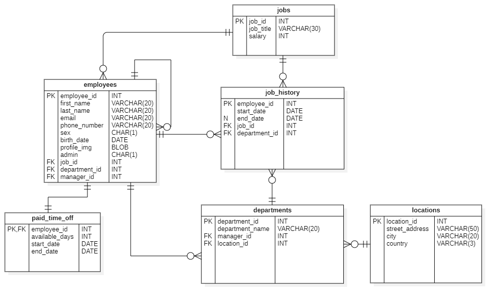

# HRM-Software

Simple **H**uman **R**esource **M**anagement Software.

# Info

This is an example project, therefore the features are bare-bones and some might not realistically model their real-world equivalent.

Technologies used are Java, 

# Features

+ Adding, managing and deleting employees
+ Dummy login page to choose between Admin and User privileges
+ Displaying and managing employee info (personal and job related)
+ Requesting paid time-off

# Database structure

